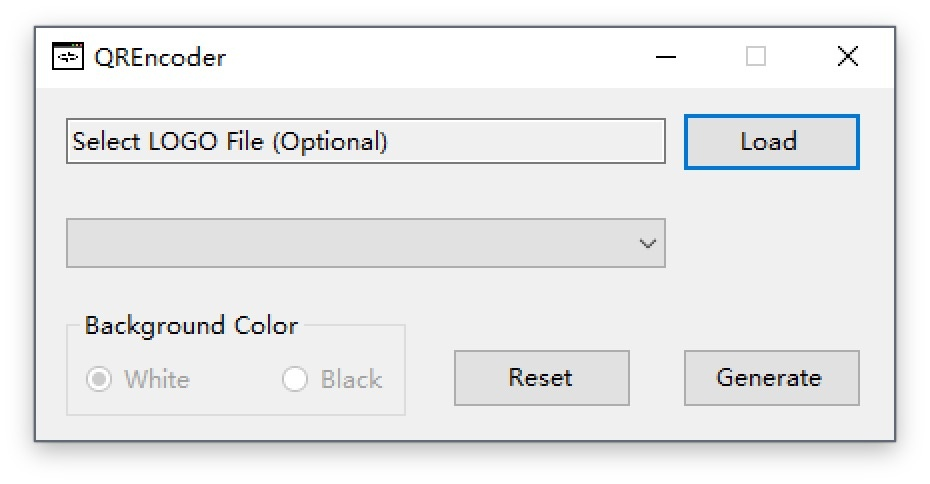

# QREncoderGUI
QRCode encoder with GUI based on [ZXing.NET](http://zxingnet.codeplex.com/)

## Preview

 

## Usage

You need to add [ZXing.NET](http://zxingnet.codeplex.com/) reference in Visual Studio before running `QREncoderGUI`.

## Performance 

According to my test, it takes 80 seconds for a single thread to generate 1000 QRCode images, but under the same conditions `QREncoderGUI` takes only about 16 seconds.
